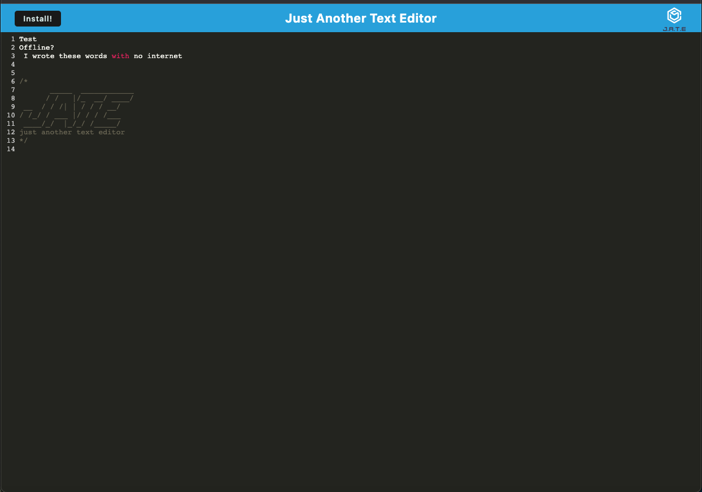

# Browser-enabled Text Editor

## Deployed Link
https://td-the-text-editor.herokuapp.com/

## Github Repo
https://github.com/timdolan14/Text-Editor

## Description

I have developed a user-friendly text editor application that offers seamless functionality in both online and offline environments. To guarantee data persistence and prevent any loss, I have implemented multiple data storage options within the application. 

This text editor application aims to enhance users productivity and creativity. It serves as a versatile platform where developers can easily organize their thoughts, experiment with code, and quickly iterate on their ideas. Whether online or offline, this application serves as a valuable resource to empower developers throughout their coding journey.

## Usage
To review this Site Creation, you can review the notes in each section. Open the Chrome DevTools by pressing Command+Option+I (macOS) or Control+Shift+I (Windows). A console panel should open either below or to the side of the webpage in the browser.

## Credits
N/A

## License
N/A